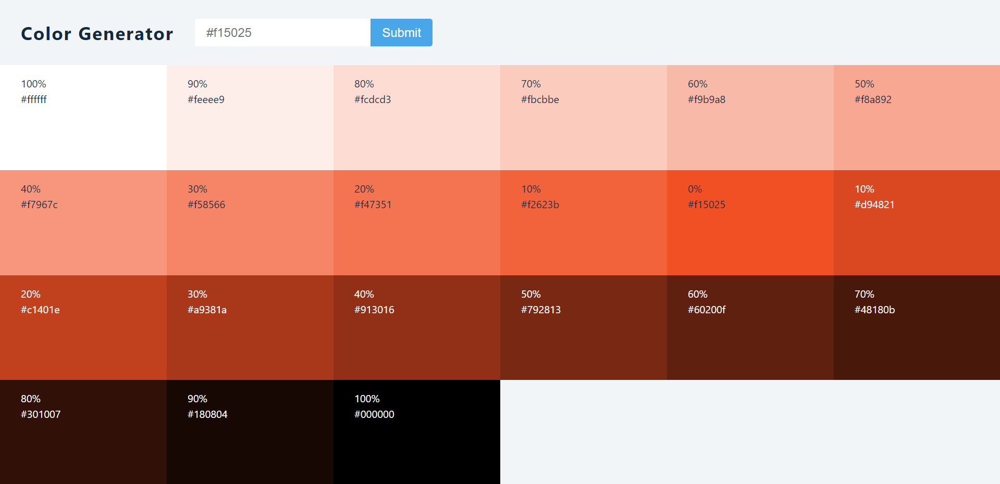

# Colour generator React App

---
`The lightness or darkness of a color is called its value. Tints are light values that are made by mixing a color with white, which increases lightness. Shades are dark values that are made by mixing a color with black, which reduces lightness.`

---

## Description
- Tints and Shades of colours are generated using Values.js package. Click here to read documentation [Values.js](https://github.com/noeldelgado/values.js#valuesjs) .
- For every colour 10 tints and 10 shades are generated whose hex code can be copied easily just by clicking on the colour block.
- If invalid hex code is given in input, error is shown.

---